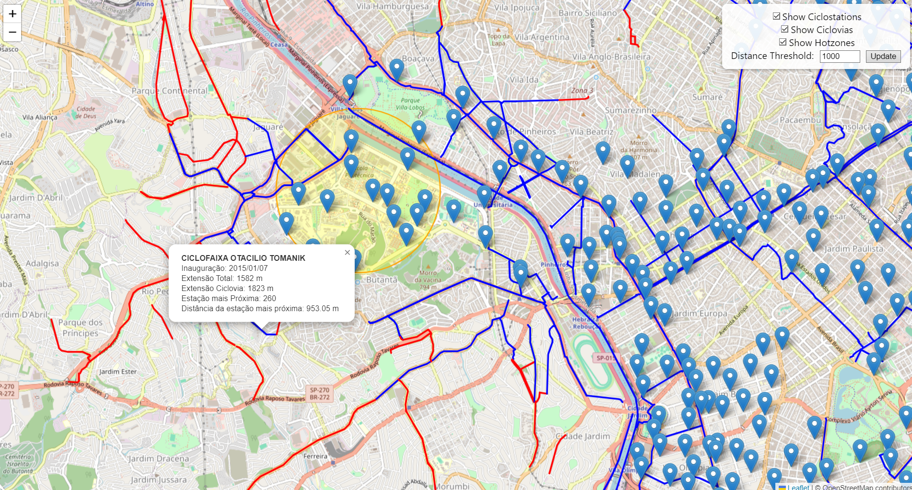

# Aplicação Web para Análise de Ciclofaixas e Estações de Bicicletas em São Paulo

**Descrição**:  
Esta aplicação web interativa, desenvolvida em React, faz parte de um Trabalho de Conclusão de Curso (TCC) em Ciência da Computação. O projeto fornece uma visualização detalhada da infraestrutura cicloviária de São Paulo, incluindo ciclofaixas, estações de bicicletas compartilhadas e zonas de alta demanda de viagens (hotzones).  

Os dados são obtidos de uma API backend desenvolvida em Python, que realiza cálculos geográficos e serve os resultados em formato GeoJSON.  

A aplicação é projetada para fornecer informações úteis a organizações, operadoras de bicicletas compartilhadas e gestores urbanos interessados em melhorar a infraestrutura cicloviária.  

**Objetivo**:
O projeto busca fornecer insights detalhados e acessíveis para empresas, organizações e gestores urbanos interessados em otimizar a infraestrutura cicloviária. Isso inclui a identificação de rotas mais utilizadas, áreas prioritárias para melhorias e análise de dados que podem auxiliar na tomada de decisões estratégicas.
---

## **Funcionalidades**


1. **Visualização Interativa**:  
   - Exibe ciclofaixas de São Paulo e localizações das estações de bicicletas compartilhadas.  

2. **Filtros Personalizáveis**:  
   - Filtrar ciclofaixas sem uma estação de bicicleta próxima (com intervalo configurável pelo usuário).  
   - Exibir hotzones com alta densidade de viagens.  

3. **Dados de Viagem e Rotas Mais Frequentes**:  
   - Destacar rotas mais utilizadas pelos usuários.  

4. **Interatividade no Mapa**:  
   - Ao clicar em uma ciclofaixa: mostra a estação mais próxima.  
   - Ao clicar em uma estação: exibe para quais estações a maioria das viagens se destina.  

5. **Futuras Melhorias Planejadas**:  
   - Melhoria no design da página para uma experiência de usuário aprimorada.  
   - Possibilidade de upload de arquivos GeoJSON personalizados para análise.  

---

## **Tecnologias Utilizadas**

- **Frontend**: React, JavaScript  
- **Backend**: Django API (separado, disponível em outro repositório)  
- **Mapas**: Leaflet, Mapbox ou Folium para renderização interativa  

---

## **Como Executar o Projeto**

1. **Instale as dependências**:  
   ```bash
   npm install
   ```

2. **Configure o ambiente**:  
   Certifique-se de que a API backend está em execução e configurada corretamente.  

3. **Inicie o projeto**:  
   ```bash
   npm start
   ```

4. **Acesse a aplicação**:  
   Abra o navegador e acesse `http://localhost:3000`.  

---

## **Fluxo de Dados**

1. **API Backend**:  
   Fornece os dados no formato GeoJSON por meio de três endpoints:  
   - Ciclofaixas: `/api/ciclovias/`  
   - Estações: `/api/estacoes/`  
   - Hotzones: `/api/hotzones/`  

2. **Frontend**:  
   - Consome os dados da API para exibição interativa no mapa.  
   - Implementa filtros e cálculos adicionais baseados nas configurações do usuário.  


## **Próximos Passos**

1. **Design e UX**:  
   Planejamos aprimorar o design geral da aplicação, com foco na usabilidade e responsividade.  

2. **Funcionalidades Avançadas**:  
   Implementar a opção de upload de arquivos personalizados para análise.  

3. **Integração com Mapas Avançados**:  
   Explorar serviços como Mapbox para visualizações mais dinâmicas e detalhadas.  

---